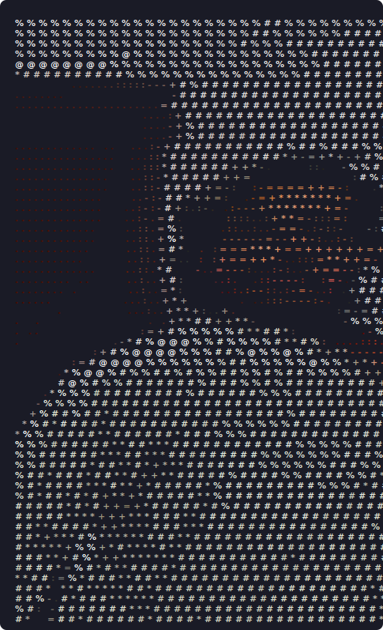
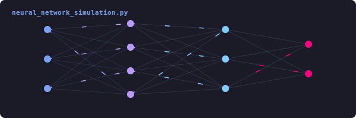

<!-- Premium Animated typing header v3 -->

  

  
  
  

<!-- Smooth layered SVG wave animation -->

  

<!-- Terminal workstation setup (ASCII + Neofetch) -->
<table align="center" border="0" cellpadding="0" cellspacing="0">
  <tr>
    <td valign="top" align="center">
      
    </td>
    <td width="30"></td>
    <td valign="top" align="center">
      
    </td>
  </tr>
</table>

 

<!-- AI-themed animated neural network node graph -->

  

<!-- Smooth layered SVG wave animation -->

  

## 🚀 About Me
- 🎓 **Education:** Pursuing B.Tech in Computer Science & Engineering (specializing in **AI & Machine Learning**) at **Kalinga Institute of Industrial Technology (KIIT)**, Bhubaneswar (2024 – 2028).
- 💼 **Internships:**
  - **NoonRay Energy Pvt. Ltd.** (Software Development Intern): Built energy analytics modules and battery simulation dashboards in Python.
  - **Black and White Marketing Solutions** (Software Development Intern): Developed frontend & backend features using Java, Python, and C.
- 🛠️ **Core Expertise:** Computer Vision (YOLOv8, OpenCV), Reinforcement Learning (PyTorch, SAC/RL), and Full-Stack Web Development.
- ⚡ **Fun Fact:** NCC Cadet (Grade B) from 3 Raj Naval Unit.

---

## 🛠️ Featured Projects

### 🌟 [CrowdSense AI](https://github.com/devendrarajsingh07/CrowdSense-AI)
- **Tech Stack:** `YOLOv8, FastAPI, OpenCV, SQLite`
- **Overview:** AI-powered real-time crowd monitoring dashboard with PDF reports.

### 🌟 [AI Battery Fast Charging](https://github.com/devendrarajsingh07/AI-Battery-Charging)
- **Tech Stack:** `PyTorch, SAC/RL, Gymnasium, Streamlit`
- **Overview:** SAC reinforcement learning agent optimizing lithium-ion battery charging.

### 🌟 [Trading Log System](https://github.com/devendrarajsingh07/Trading-Log-System)
- **Tech Stack:** `React.js, Node.js, Express, MySQL, JWT`
- **Overview:** Full-stack app to track stock/crypto trades with dashboard analytics.

<!-- Smooth layered SVG wave animation -->

  

## 📊 Contributions & Activity

<!-- Staggered animated contribution graph -->

  

<!-- Contribution grid snake game (updated via GitHub Actions) -->

  

---

## 📊 GitHub Stats

  
  

 

Last updated on: <b>July 16, 2026</b>
