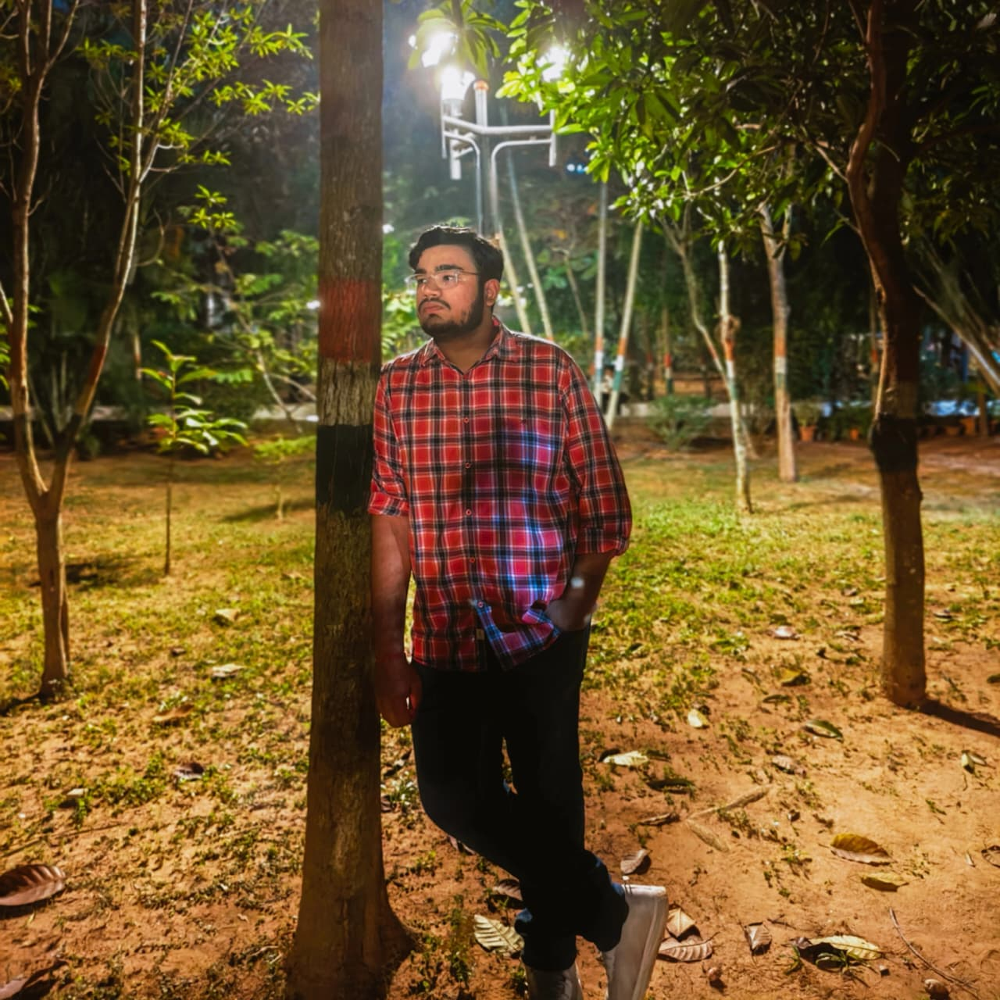

<!-- Generated from README.template. Edit this file, not README.md. -->

  

  
  
  
  

  

<table align="center" border="0" cellpadding="0" cellspacing="0">
  <tr>
    <td valign="top" align="center">
      
    </td>
    <td width="24"></td>
    <td valign="top" align="center">
      
    </td>
  </tr>
</table>

## About me

I build practical AI systems and full-stack products where machine learning, real-time data, and thoughtful interfaces meet.

- 🎓 B.Tech CSE (AI & ML) at **KIIT**, Bhubaneswar — Class of 2028
- 🧠 Exploring **digital twins, computer vision, predictive systems, and responsible AI**
- 🛠️ Comfortable across the stack, from Python/FastAPI services to React/Next.js interfaces
- 🤝 Open to internships, collaborations, and ambitious product ideas
- ⚓ NCC Naval Wing cadet with a Grade B certificate

## Tech I work with

  
  
  
  
  
  
  
  
  
  
  

## Featured work

| Project | What it does | Stack |
|:--|:--|:--|
| **[Human Digital Twin](https://github.com/devendrarajsingh07/Human-Digital-Twin0.1)** | A continuously learning student wellness twin with 3D visualization, forecasting, what-if simulation, and fidelity tracking. | `Next.js 15 · React 19 · FastAPI · Three.js · PostgreSQL` |
| **[MGHSIS](https://github.com/devendrarajsingh07/SIH2026-MGHSIS.)** | A local-first mass-gathering safety platform combining wearable telemetry, crowd analytics, risk prediction, and a venue digital twin. | `Next.js 16 · FastAPI · PostgreSQL · Redis · Python` |
| **[BillingPro SaaS](https://github.com/devendrarajsingh07/billingpro-saas)** | A multi-tenant billing and ERP platform with invoicing, inventory, payments, RBAC, subscriptions, and reporting. | `React 19 · Node.js · Express · SQLite · Docker` |
| **[CrowdSense AI](https://github.com/devendrarajsingh07/CrowdSense-AI)** | A real-time crowd monitoring and analytics platform with live detection, alerts, video analysis, and PDF reports. | `YOLOv8 · OpenCV · FastAPI · SQLite · Chart.js` |

## GitHub activity

  
  

  

  <i>Build useful things. Learn in public. Keep improving.</i> 
  Profile refreshed September 25, 2026

